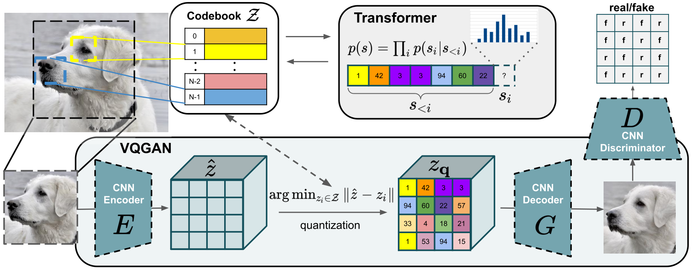

Deep Ensembles ([@fort2019ensemble])
------------------------------------

So you have a dataset of $x\in\mathbb{R}^d$ and try to predict $y$. If
you build a neural network to predict it and make an ensemble from them.
You can input $x$ to all models and aggregate output. For example, mean
averaging.

Imaging your neural net has only single weight. After you optimize you
get somewhere on axis. So you fit to the best training accuracy. There
are different picks of top accuracies.

What if we create a model that will capture all distribution of possible
weights.

What they did? They look into training trajectory of the single run.
This paper is half about ensembling and half about the training process.
The first thing is we have a random initialization. We do gradient
descent and reach local minina. You repeat a process with different
random initialization point. The question is do these local minimas
describe the same optimal functions or are they fundementally different
functions that just happend to reach same accuracy.

ELBO
----

Evidence lower bound

$$\mathbb{E}[\log{p_\theta(x|z)}] - \mathbb{E}[\log{\frac{q_\phi(z|x)}{p_\theta(z)}}]$$

Latent variable model and bayes rule to obtain the
posterior distribution: Posterior $p_\theta(z|x)$, likelihodd
$p_\theta(x|z)$, prior $p_\theta(z)$, normalizing constant (evidence)
$p_\theta(x)$,

$$p_\theta(z|x) = \frac{p_\theta(x|z)p_\theta(z)}{p_\theta(x)}$$

Approximate the **posterior** with another distribution $q_\phi(z|x)$.
So our goal is defined $p_\theta(z|x)\approx q_\phi(z|x)$. That is
simply to approximate the intactable posterior distribution with a
simpler distribution. But we still have to learn parameters $\phi$ using
optimization. Optimization requires a loss function. We need to predict
the similarity between two probability distributions $p$ and $q$. So we
need KL-divergence $D_{KL}(p_\theta|q_\phi)$. Let's calculate reserve
KL.

$$D_{KL}(q_\phi|p_\theta) = \mathbb{E}_{q_\phi}[\log{\frac{q_\phi(z|x)}{p_\theta(z|x)}}]$$

We need to minimize it, but we have trouble with denominator
$p_\theta(z|x)$ which we want to approximate.

$$\begin{aligned}
        \text{KL} \big( q(\mathbf{z}) || p(\mathbf{z} | \mathbf{x}) \big)
         & = \int q(\mathbf{z}) \log \frac{q(\mathbf{z})}{p(\mathbf{z} | \mathbf{x})} d\mathbf{z}                                                  & \text{(1.1)} \\
         & = \int q(\mathbf{z}) \big( \log q(\mathbf{z}) - \log p(\mathbf{z} | \mathbf{x}) \big) d\mathbf{z}                                       & \text{(1.2)} \\
         & = \int q(\mathbf{z}) \log q(\mathbf{z}) - q(\mathbf{z}) \log p(\mathbf{z} | \mathbf{x}) d\mathbf{z}                                     & \text{(1.3)} \\
         & = \int q(\mathbf{z}) \log q(\mathbf{z}) d\mathbf{z} - \int q(\mathbf{z}) \log p(\mathbf{z} | \mathbf{x}) d\mathbf{z}                    & \text{(1.4)} \\
         & = \mathbb{E}_{q} \big[ \log q(\mathbf{z}) \big] - \mathbb{E}_{q} \big[ \log p(\mathbf{z} | \mathbf{x}) \big]                            & \text{(1.5)} \\
         & = \mathbb{E}_{q} \big[ \log q(\mathbf{z}) \big] - \mathbb{E}_{q} \bigg[ \log \frac{p(\mathbf{x}, \mathbf{z}) }{p(\mathbf{x})} \bigg]    & \text{(1.6)} \\
         & = \mathbb{E}_{q} \big[ \log q(\mathbf{z}) \big] - \mathbb{E}_{q} \big[ \log p(\mathbf{x}, \mathbf{z}) - \log p(\mathbf{x}) \big]        & \text{(1.7)} \\
         & = \mathbb{E}_{q} \big[ \log q(\mathbf{z}) - \log p(\mathbf{x}, \mathbf{z}) \big] + \mathbb{E}_{q} \big[ \log p(\mathbf{x}) \big]        & \text{(1.8)} \\
         & = \mathbb{E}_{q} \big[ \log q(\mathbf{z}) - \log p(\mathbf{x}, \mathbf{z}) \big] + \underbrace{\log p(\mathbf{x})}_{\text{intractable}} & \text{(1.9)} \\
    \end{aligned}$$

$\log{p_\theta(x)}$ - marginal log likelihood (Log evidence)

$$\mathbb{E}_{q} \big[\log p(\mathbf{x}, \mathbf{z}) - \log q(\mathbf{z}) \big] = \log p(\mathbf{x}) - \text{KL} \big( q(\mathbf{z}) || p(\mathbf{z} | \mathbf{x}) \big)$$

As $KL \geq 0$

$$\mathbb{E}_{q} \big[\log p(\mathbf{x}, \mathbf{z}) - \log q(\mathbf{z}) \big] \leq \log p(\mathbf{x})$$

The left part called evidence lower bound

$$\begin{aligned}
        \mathrm{ELBO}(q)
         & =\mathbb{E}_{q} \big[\log p(\mathbf{x}, \mathbf{z}) - \log q(\mathbf{z}) \big]                                                 & \text{(2.1)} \\
         & =\mathbb{E}_{q}[\log p(\mathbf{z}, \mathbf{x})] -\mathbb{E}_{q}[\log q(\mathbf{z})]                                            & \text{(2.2)} \\
         & =\mathbb{E}_{q}[\log \big( p(\mathbf{x} \vert \mathbf{z}) p(\mathbf{z}) \big) ] -\mathbb{E}_{q}[\log q(\mathbf{z})]            & \text{(2.3)} \\
         & =\mathbb{E}_{q}[\log p(\mathbf{x} \vert \mathbf{z})] + \mathbb{E}_{q}[\log p(\mathbf{z})] - \mathbb{E}_{q}[\log q(\mathbf{z})] & \text{(2.4)} \\
         & =\mathbb{E}_{q}[\log p(\mathbf{x} \vert\mathbf{z})] + \mathbb{E}_{q}[\log p(\mathbf{z}) - \log q(\mathbf{z})]                  & \text{(2.5)} \\
         & =\mathbb{E}_{q}[\log p(\mathbf{x} \vert \mathbf{z})] + \int q(\mathbf{z}) \log \frac{p(\mathbf{z})}{q(\mathbf{z})} d\mathbf{z} & \text{(2.6)} \\
         & =\mathbb{E}_{q}[\log p(\mathbf{x} \vert \mathbf{z})]- \text{KL}(q(\mathbf{z}) \| p(\mathbf{z}))                                & \text{(2.7)}
    \end{aligned}$$

CLIP
----

How do we connect images with text. What if we have dataset of
image-text pairs. This kind of images you can find on the Internet, so
it's relatively easy to get that kind of dataset. If we can somehow
learn to connect images with text. We won't be bound with the labels for
classification. We will get very good representation.

So how it works. We are going to take an image, pass it through encoder.
It gives us image representation, vector in latent space. We will do it
in batches $I_1, ..., I_n$. We also obtain a vector
representation for text $T_1, ..., T_n$. In the training set we know
that $I_1$ goes with $T_1$ and so on, because we scape dataset in that
way.

Previously we try to predict image with text. So we take an image vector
and try to predict the text. We no longer do that. We are simply ask the
model for this representation which of these texts are the most
appropriate. So that's an constractive objective. We fit an image and
ask it which of all these texts are the closest. You see that it heavily
relies on batch size.

On inference. You take an image, put it through image encoder and get
image representation model. You get all labels of classification task.
You engineer a prompt. You encode all labels with prompt context through
text encoder. You simply ask wich of this labels is the closest, so the
inner product is the hightest. Zero training needed
([@radford2021learning]).

Diffusion Models
----------------

Diffusion model is different type of generative model. GAN basically is
a neural network with bunch layers. You sample some noise, you get the
noise vector $z$. You put the $z$ through the network and it gives you a
picture. You train network using discriminator to produce pictures. So
the mapping is noise to picture.

In diffusion models it's the reverse. You take an image. You are going
to put a noise on the image. So you get a slightly noisy version of
image. Then you do it again and again. Your picture will get noiser and
noiser. What comes at the end is just a noirmaly distributed noise.
However every step is very small. Technicaly it's possible for the model
to look a slightly noised image and predict the sharp version. The
individual step is small enough, so the model can reconstruct it.
However if we do it long enough we are adding standart normal
distribution. So we can sample some noise from standart distribution.
Put it throught the process of reconstruction.

![Diffusion model[]{label="fig:ddpm"}](images/ddpm.png)

Given a sample from the data distribution $x_0 \approx q(x_0)$. We
produce a Markov chain of latent variables $x_1, ..., x_T$. With $x_T$
finally be a normal distribution.

$$q(x_t|x_{t-1}) = \mathcal{N}(x_t; \sqrt{\alpha_t}x_{t-1}, (1-\alpha_t)\mathcal{I})$$

$$mean~vector = \sqrt{\alpha_t}x_{t-1}$$

$$covariance~matrix=(1-\alpha_t)\mathcal{I}$$

If the magnitute $1-\alpha_t$ of the noise added to each step is small
enough, the posterior $q(x_{t-1}|x_t)$ is well approximated by a
diagonal Gaussian. Furthermore, if the magnitute $1-\alpha_1...\alpha_t$
of the total noise is large enough, $x_T$ is well approximated by
$\mathcal{N}(0, \mathcal{I})$. These properties suggest learning a model
$p_\theta(x_{t-1}|x_t)$ to approximate true posterior. So basically, we
are going to train a neural net, which doesn't exactly going reconstruct
the image, but that's a variational model. So we are going to plug the
$x_t$ to a neural net and it will give us mean and covariance matrix of
the next step of the chain:

$$p_\theta(x_{t-1}|x_t)=\mathcal{N}(\mu_\theta(x_t), \Sigma_\theta(x_t))$$

So we start with the Gaussian noise $x_T=\mathcal{N}(0, \mathcal(I))$
and gradually reducing the noise in a sequence of steps
$x_{T-1}, x_{T-2}, ..., x_0$ ([@ho2020denoising]).

Since we always adding Gaussian noise, we can add it in a one step.
Rather then predicting image by itself, we are predicting noise
$\epsilon=x_{t}-x_{t-1}$. That is standart diffusion models.

Guided diffusion models
-----------------------

Next thing is guided diffusion models ([@nichol2021improved]). Their
show a method to learn covariance matrix $\Sigma_\theta$. Let's assume
we have images and the class label. We can train neural net to predict
noise, but we can also give it a label $y$. So we train a class
conditional model. It has some advantages. Class conditional models are
fine, but we can do better. We could guide our model more. One way to do
that is to say I have a classifier. For example based on ImageNet. If I
want to push my diffusion process toward a particular label. I can take
an ImageNet classifier and I can go along the gradient of that.

We can do CLIP guided diffusion process by taking
$\nabla_{x_t} CLIP(x_t, text)$. More formally,
$\nabla_{x_t} log_{p_\phi}(y|x_t)$. You can push the diffusion process
into the direction where the image would fit a text more because you go
along gradient of that. It's kind of constructing adversarial example
towards this classifier.

$$\hat{\mu}_\theta(x_t|y)=\mu_\theta(x_t|y) + s * \Sigma_\theta(x_t|y) \nabla_{x_t}log_{p_\phi}(y|x_t)$$

But it means that you have to have an external classifier to go by.
There is a method to do it without classifier called classifier free
guidence. The label $y$ in a class-conditional diffusion model
$\epsilon_\theta(x_t, y)$ sometimes is replaced with a null label
$\emptyset$:

$$\hat{\epsilon}_\theta(x_t|y) = \epsilon_\theta(x_t|\emptyset) + s * (\epsilon_\theta(x_t|y) - \epsilon_\theta(x_t|\emptyset))$$

Here, $s\geq1$ is the guidance scale.

VQVAE
-----

What VAE do? It's parametrize the distribution. You have encoder, you
output vector of means $\mu$ and vector of standard deviation $\sigma$.
You also want to do $log \sigma$ so we make sure standard deviation. You
sample a vector from that distribution and put it into the decoder.
([@oord2017neural])

So how VQVAE works? We put image through encoder and get some
representation. We take vectors and snap it onto distinct codebook
(embedding space). We want to find the closest one vectors and then map
vectors from encoder and you put indexes into $q(z|x)$ matrix. And put
only those into decoder.

How to backpropagate? Copy paste the gradients from decoder to encoder
(marked with red arrow)

VQVAE - 2
---------

Does the smae but in multiscale.

VQ-GAN
------

The encoder $E$, the decoder $G$ and the codebook $Z$ can be trained
end-to-end via the following loss function [@esse2021vqgan]:

$$L_{VQVAE} = || x - \hat{x}||_1 + || sg[E(x)] -  z_q ||_2^2  + \beta || sg[z_q] - E(x)||_2^2$$

Where, $sg[\cdot ]$ stands for the stop-gradient operation.

-   Replaced L1/L2 loss with perceptual loss

-   Added also adversarial loss

VQ Diffusion Model ([@gu2021vector])
------------------------------------

DiVAE ([@shi2022divae])
-----------------------

DiVAE parametrizes $p(x|z)$ through a diffusion model

DALL-E
------

If we combine VQVAE with GPT-3 we get DALL-E ([@ramesh2021zeroshot])

DALLE-2
-------

It works different than DALL-E. The main objective is CLIP. DALLE-2 uses
CLIP as a foundation for the generative model. Previously CLIP was used
as a ranker. They have a CLIP which is frozen and gives you text and
image embeddings. What DALLE-2 does is taking text embeddings and and
there's two new parts.

The first one is a prior which can either be diffusion based or
autoregressive based. That prior is supposed to take the text embedding
and make it into image embedding. CLIP already tries to align the two
quite well. However, there's still a bit of a difference and that prior
bridges that gap. This could be trained in a supervised fasion.

The other new thing is a decoder which is a diffusion based model. So
that takes an image encoding and it forward propagates through a
diffusion model ([@ramesh2022]).

![DALLE-2[]{label="fig:dalle2"}](images/dalle2.png)

Imagen
------

They use huge text model. Instead of training a text model along with
the image generation model. They simply use big pre-trained model and
freeze it so it doesn't change during the training of image generation
model. Now we need to use text embedding to generate image. They use
diffusion model to achive that ([@saharia2022photorealistic]).
Iteratively use super resolution models. First to upscale from 64x64 to
256x226. Then split into patches and upscale to 1024x1024

Diffusers
---------

Diffusers method takes as an input few images and corresponding text
descriptions. Then it returns a fine-tuned/“personalized” text-to-image 
model that encodes a unique identifier that refers to the subject. 
Then, at inference, we can implant the unique identifier in different 
sentences to synthesize the subjects in difference contexts

Search papers
SoTA decoder
------------

Model to generate image embeddings from text
--------------------------------------------